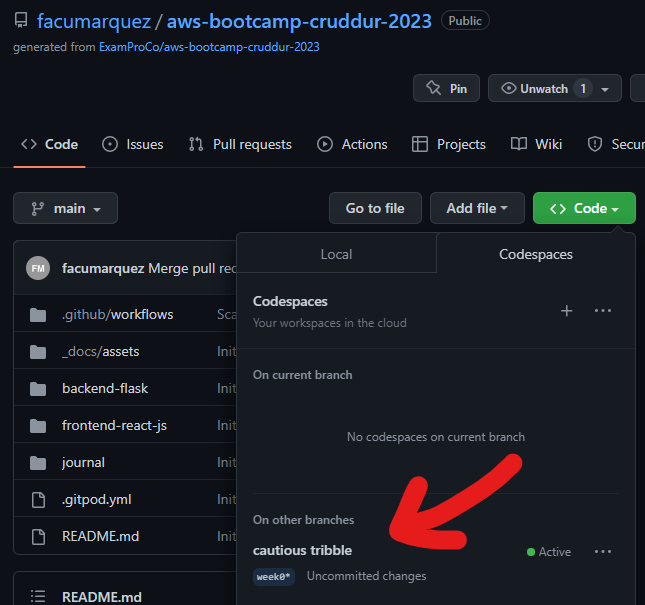
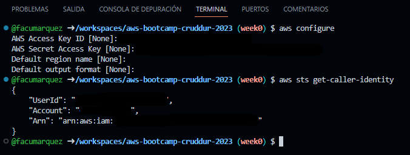
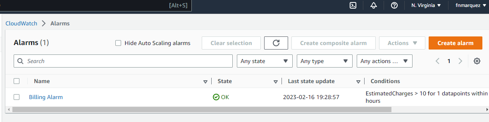
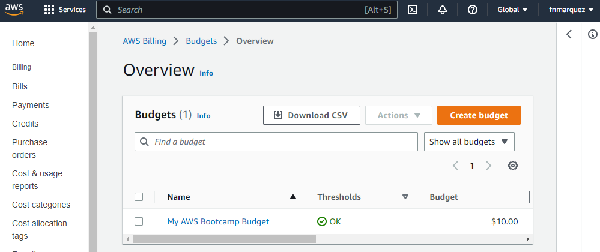
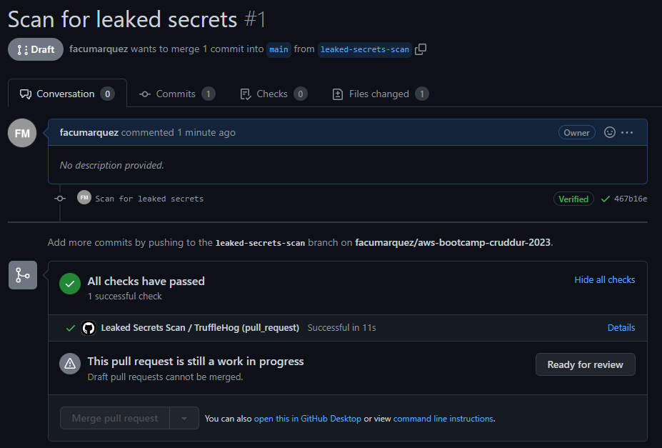

# Week 0 — Billing and Architecture

## Required Homework

### Install AWS CLI

I decided to try codespaces for my development environment.
To probe that I configure AWS CLI, I´m explaining the steps I followed and also adding some screenshots:

1. In GitHub WebUI, choose Code -> Codespaces -> Create codespace on main



2. Then I had to install the AWS CLI using the same commands provided for Gitpod:

``` bash
    cd /workspace
    curl "https://awscli.amazonaws.com/awscli-exe-linux-x86_64.zip" -o "awscliv2.zip"
    unzip awscliv2.zip
    sudo ./aws/install
```

3. Configure the AWS Credentials and then run the following command to test the connection (sensitive data is hidden):



### Created Billing Alarm



### Created Budget



### Create Architecture Diagrams:

* Conceptual -> https://lucid.app/lucidchart/0dba9028-5aad-40c6-99d2-865634ef6530/edit?invitationId=inv_63da47e9-674a-430f-8f68-603c47bf7d5b

* Logical -> https://lucid.app/lucidchart/57213573-de94-419b-befc-705f77ddb5d3/edit?invitationId=inv_a1e30904-b007-4f64-bc68-49226f311856

## Additional tasks

### Created a GitHub Action workflow

I created a GitHub Actions workflow to scan for leaked secrets everytime I create a Pull request


