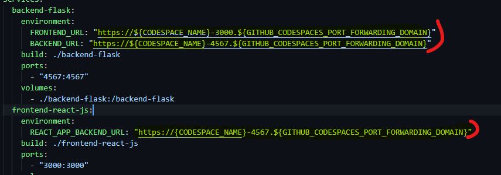
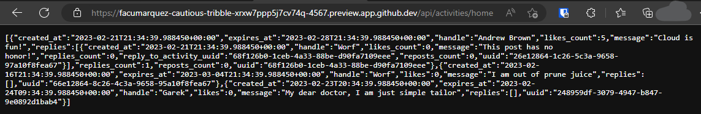
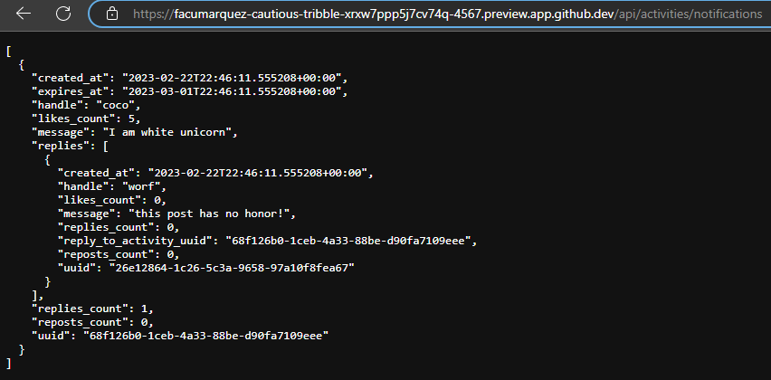
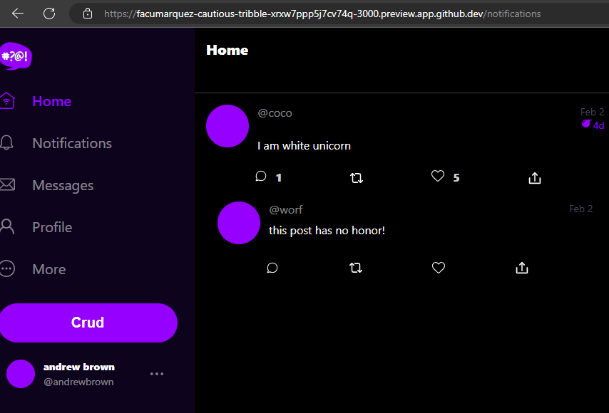
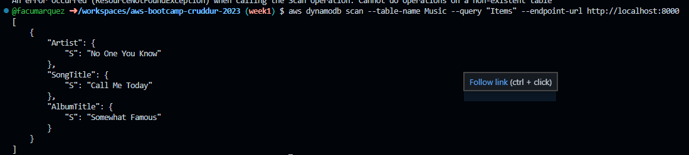
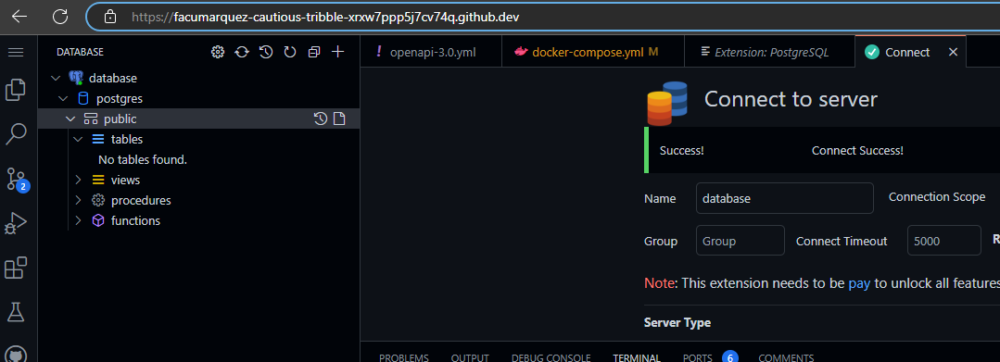

# Week 1 — App Containerization

## Required Homework

### Containerize Application (Dockerfiles, Docker Compose)
 
To probe that I did this, I am explaining the problem I had to solve.
Had to replace the gitpod environment variables with github environment variables.
By running `env | grep 3000` and `env | grep <mydomainname>` I was able to identify which variables I had to use.

Once I change this the api worked as expected:

### Document the Notification Endpoint for the OpenAI Document

The code is in the file openapi-3.0.yml

### Write a Flask Backend Endpoint for Notifications

Done it, here is the probe:

### Write a React Page for Notifications

## Run DynamoDB Local Container and PostgreSQL local

