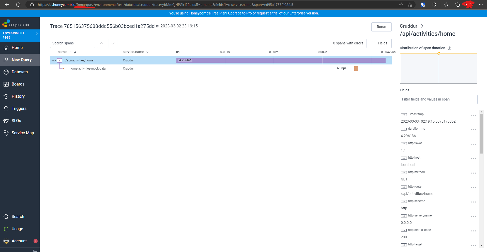
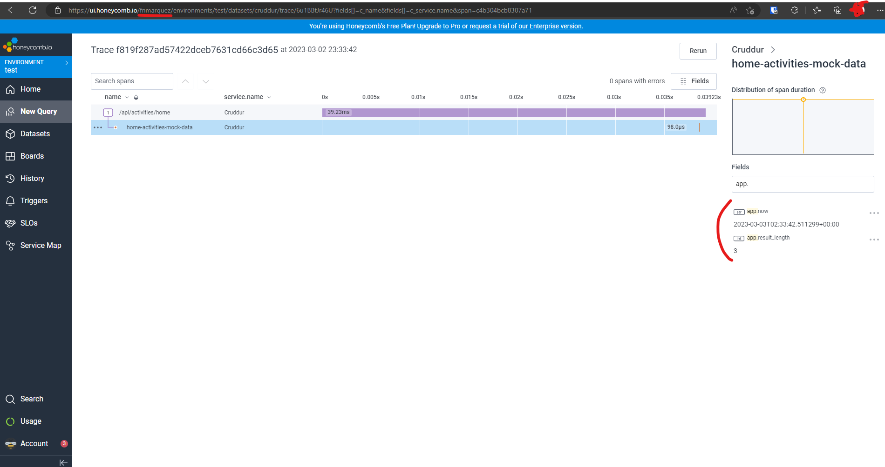
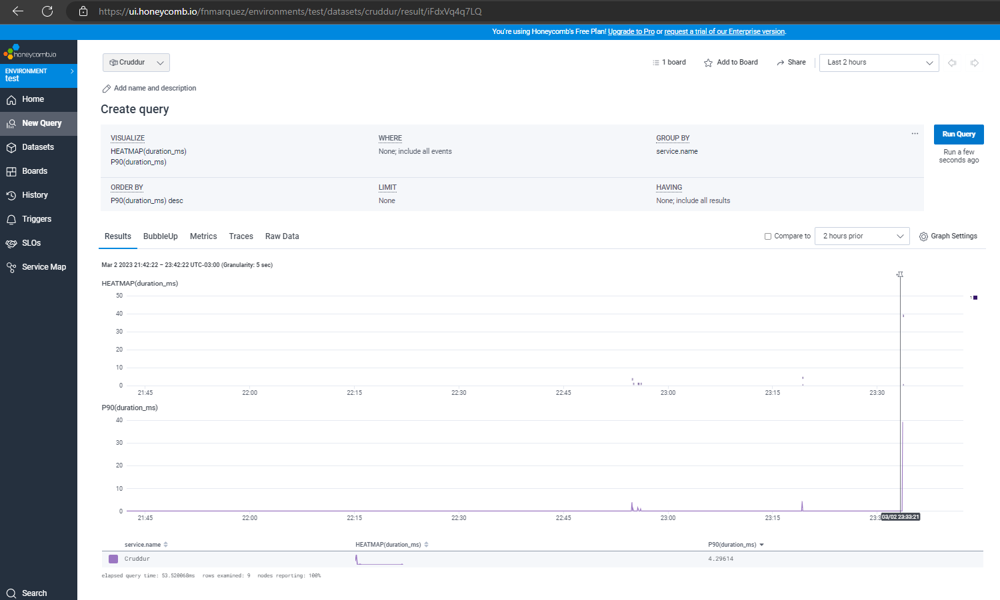
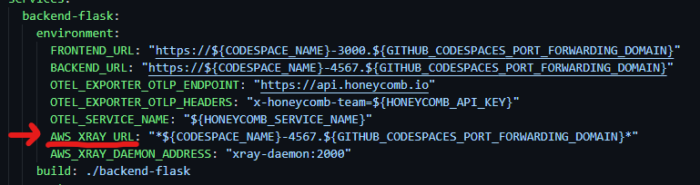
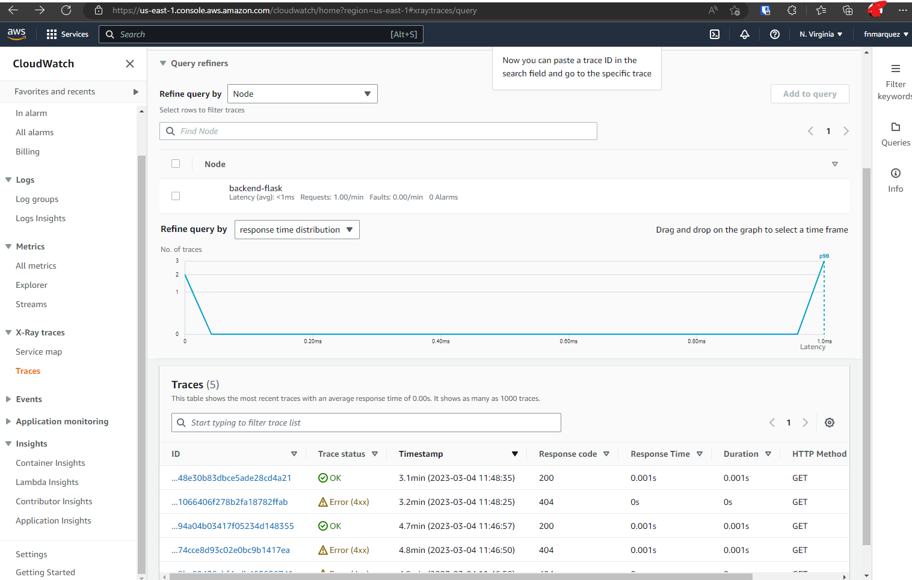
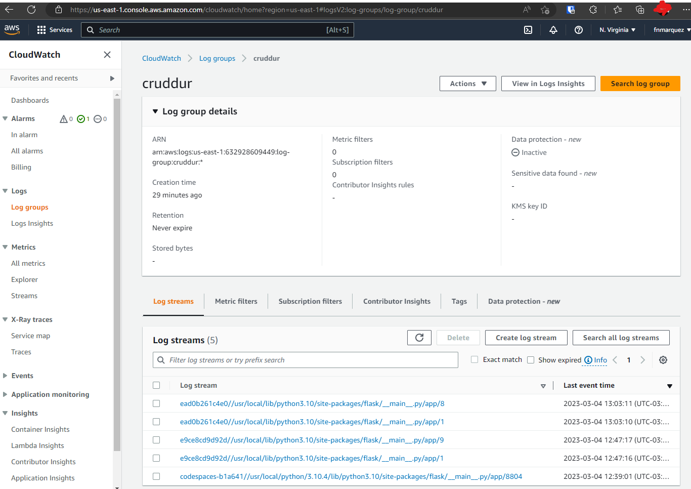
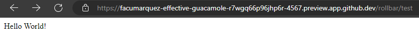
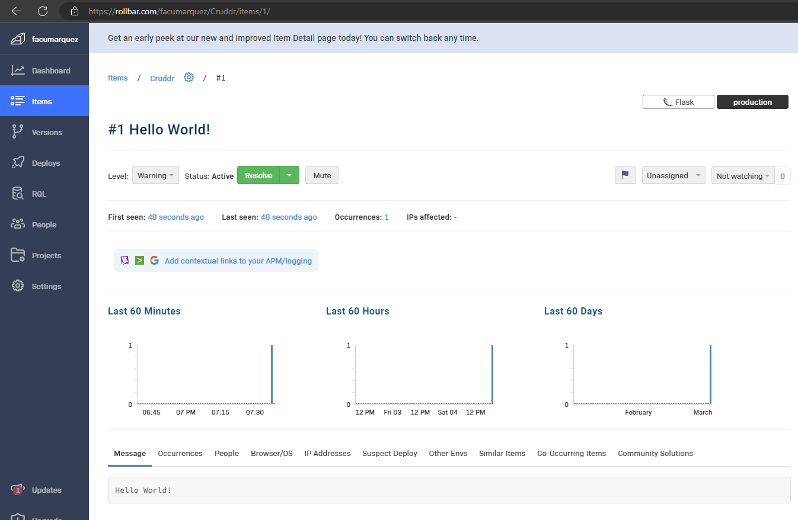

# Week 2 — Distributed Tracing

## Required Homework

### Instrument Honeycomb with OTEL

This is the probe that honeycomb is working

This is the probe that I created a span and the data was sent to Honeycomb

This the the probe that I created a new query with the available data in Honeycomb

### Instrument AWS X-Ray with Subsegments

I had to modify the variables used for the URL because in the video you were using Gitpod and in codespaces they are different.

and then the data is in x-ray:

### Configure custom logger to send to CloudWatch Logs

This is the probe that backend's logs are available in my AWS account.

### Integrate Rollbar and capture and error

The custom endpoind to test Rollbar was implemented

and the error was captured correctly, this is the probe:

 
