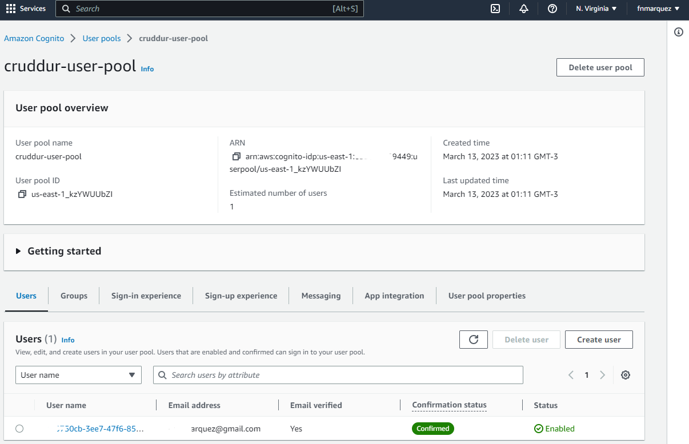
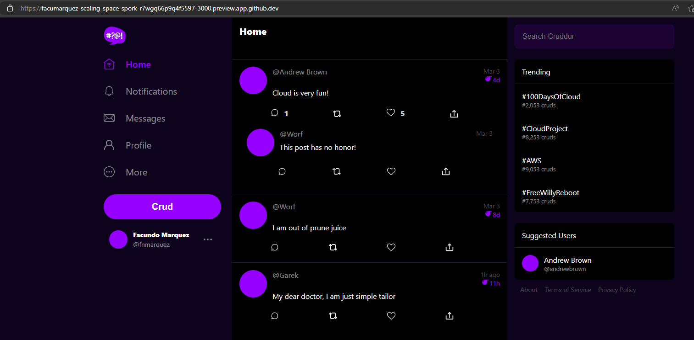
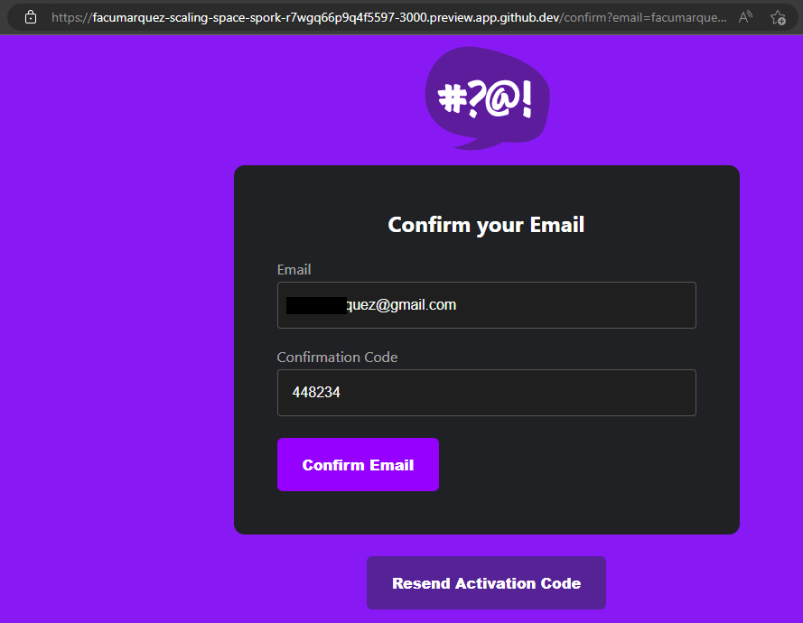
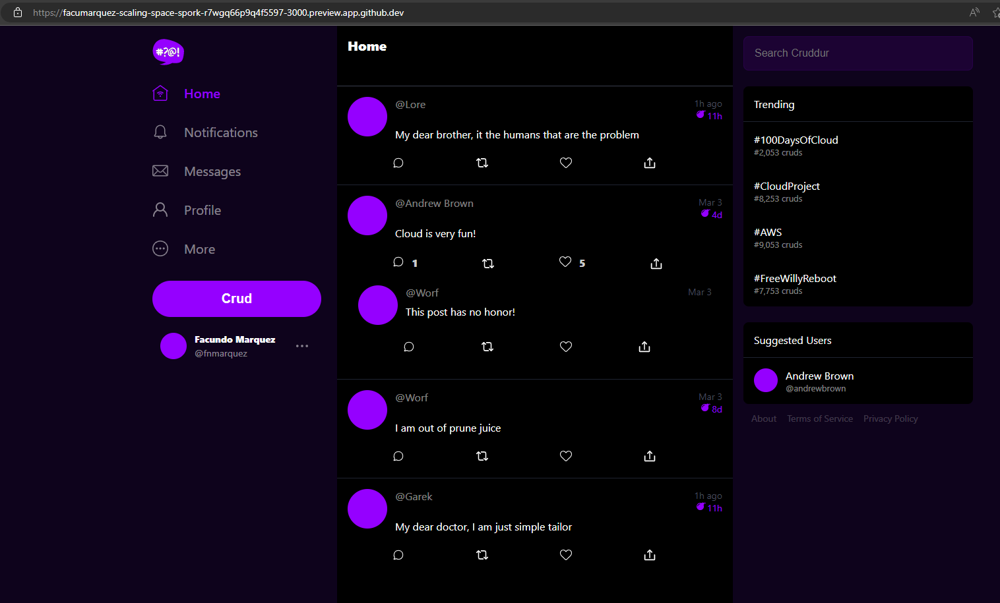
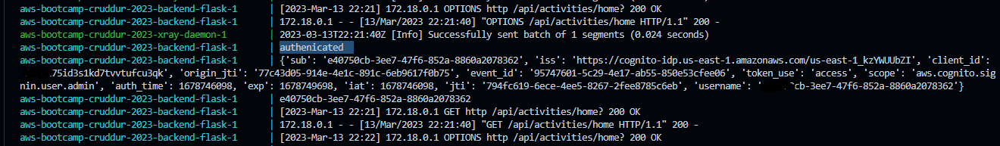
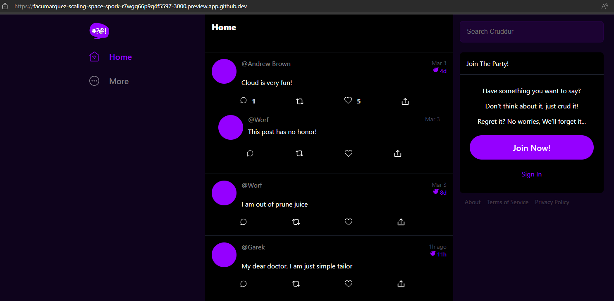
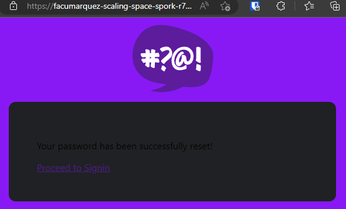
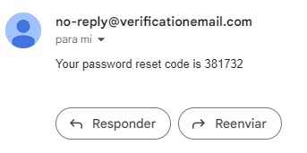

# Week 3 — Decentralized Authentication

## Required Homework

### Setup Cognito User Pool

This is the probe that I created the user pool:

### Implement Custom Signin Page

This is the probe that my signin page is working:

### Implement Custom Signup Page

This is the probe that my signup page is working:

Also I verified the backend is authenticating the users correctly:

Here we can see the latest twit with the authenticated user.

The log shows the user is authenticated

If we logout we cannot see the first twit:

### Implement Custom Confirmation Page and Custom Confirmation Page

I forgot to take a screenshot of the custom confirmation page working but as you can see the user is registered correctly.

