# Week 4 — Postgres and RDS

## Create RDS Postgres Instance

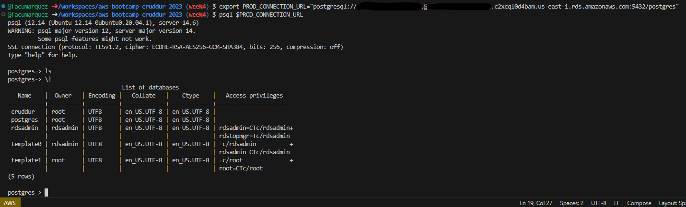

## Bash scripting for common database actions

To probe that I did this, I will explain the problem I had and how I solved it.
When I tried to run the bash scripts I got this error:

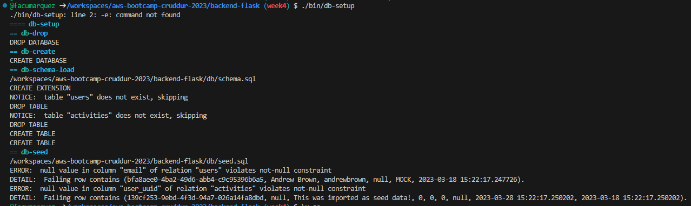

I had to add the email as a parameter here:

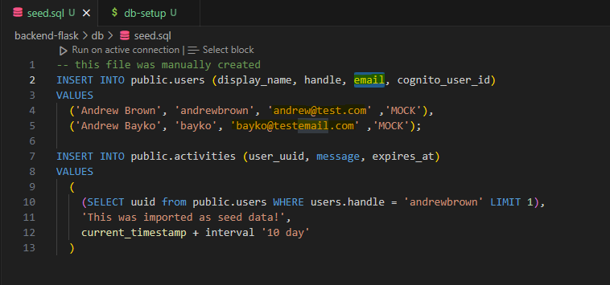

And it worked:

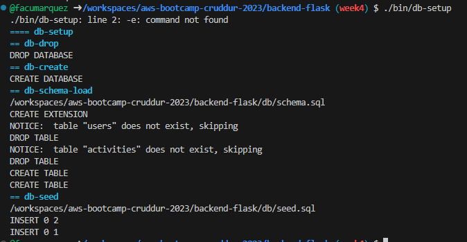

### Install Postgres Driver in Backend Application

To probe I installed Postgres driver in the backend I'm showing the error I had in the log.
This error was solved by including the file home.sql that was missing the first time I run it.

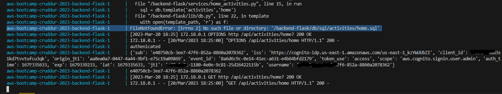

After adding home.sql the backend was querying the database correctly:

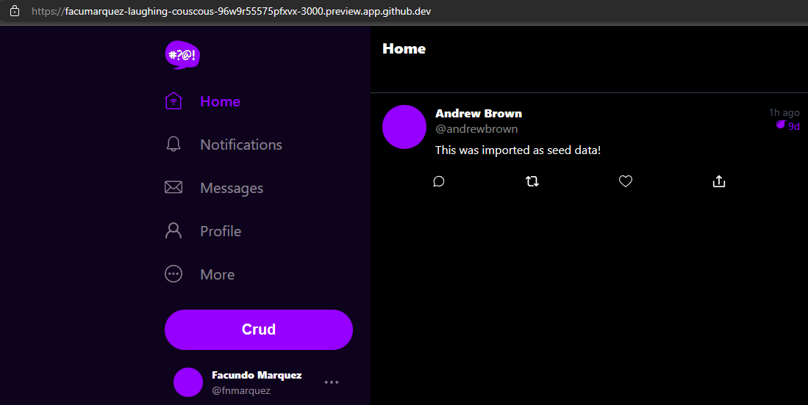

## Connect Gitpod to RDS Instance

I'm using Github Codespaces and this is the probe that I'm connected to the RDS instace:

## Create Congito Trigger to insert user into database

This is the probe that I created the trigger:

The first time it was failing because my RDS was shutdown and this is the error in Cloudwatch

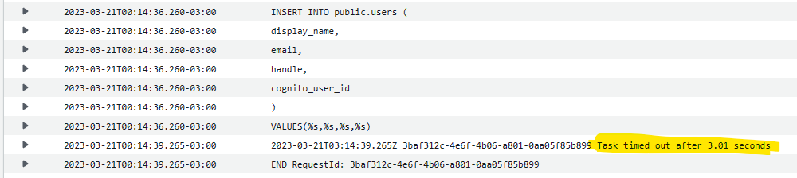

After starting the database instance the data was inserted in the database:

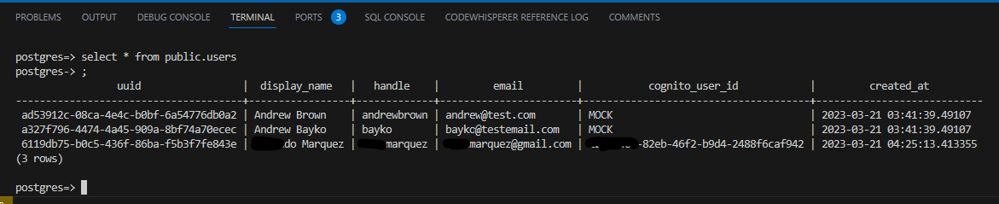

and the user was created in cognito:

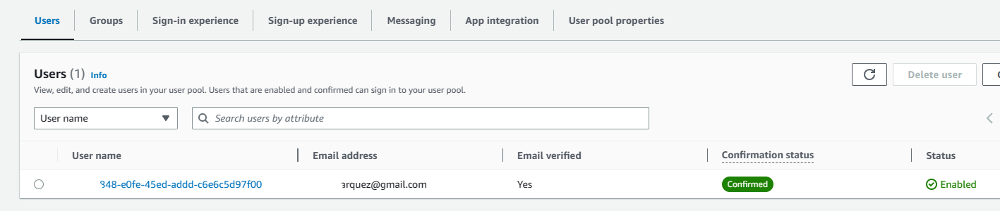

## Create new activities with a database insert

I was able to complete this task but there is an issue that I couldn't fix.
The message is being posted correctly but it is assigning a wrong uuid in the database, instead of assigning my uuid it's using Andrew Brown's uuid

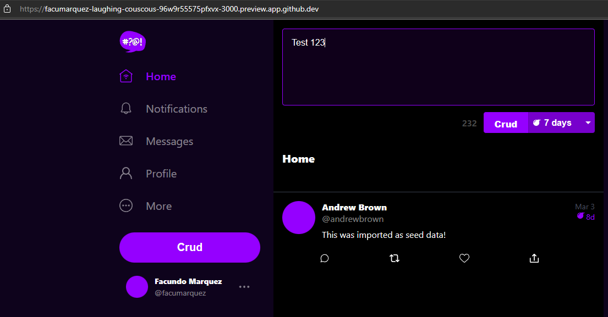

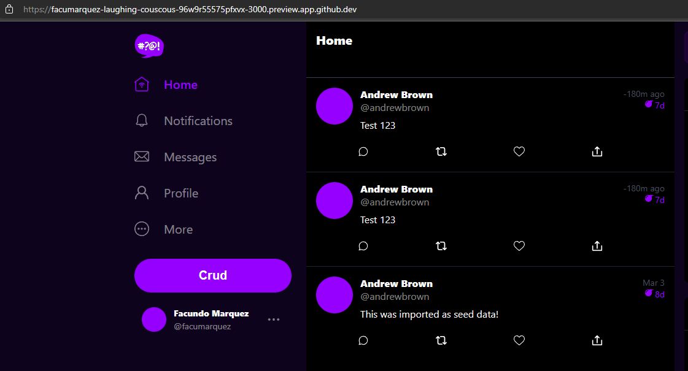

and this is how the data looks:

