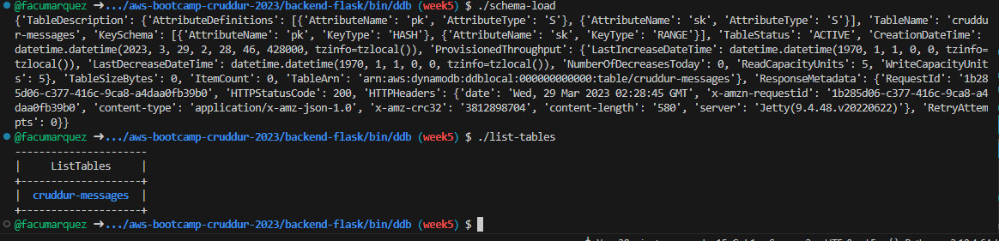
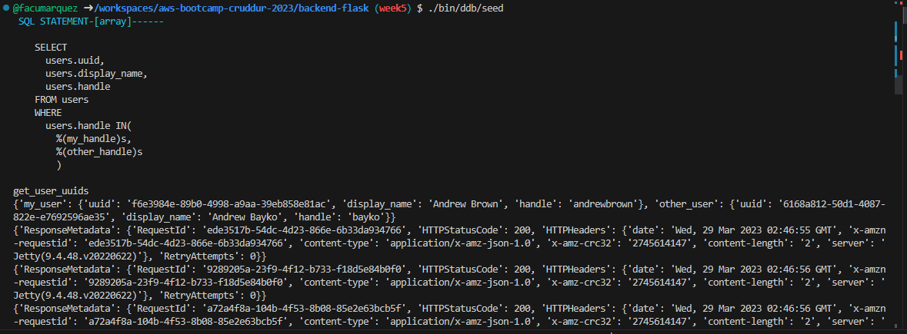
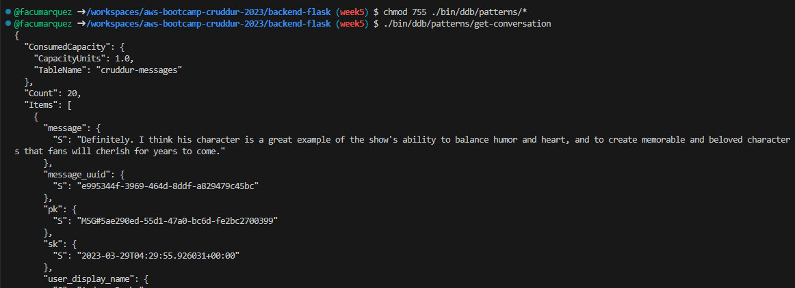
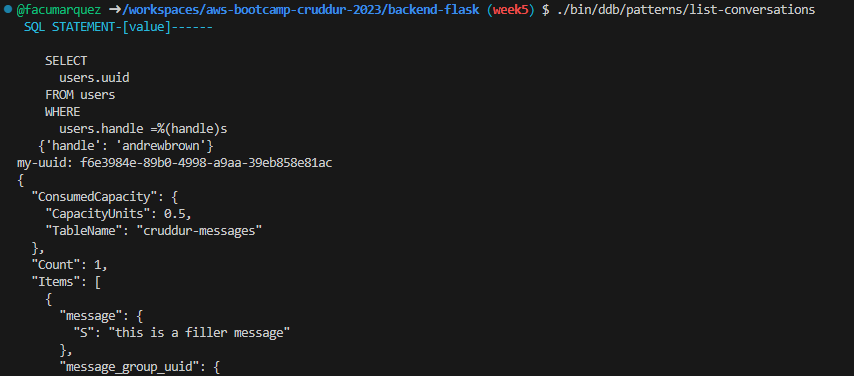
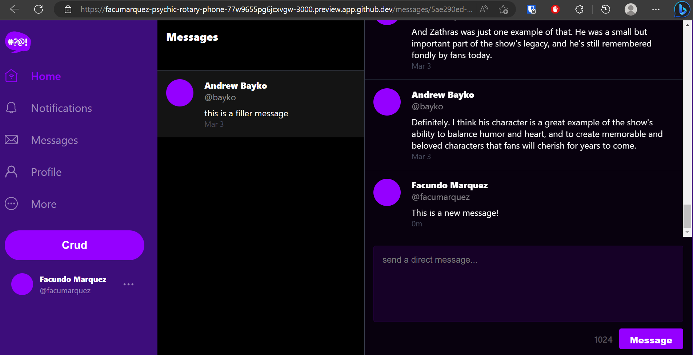
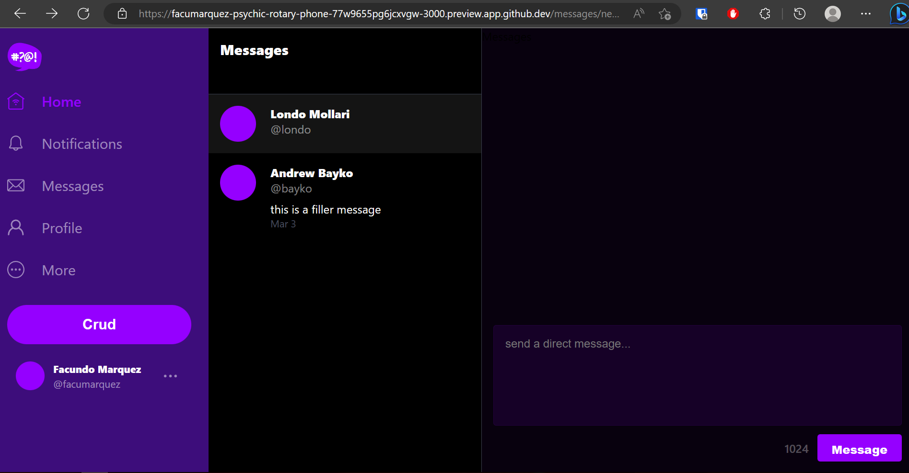
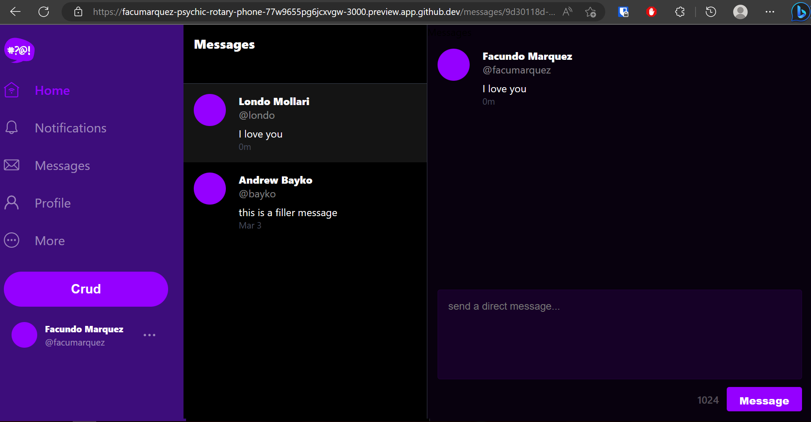
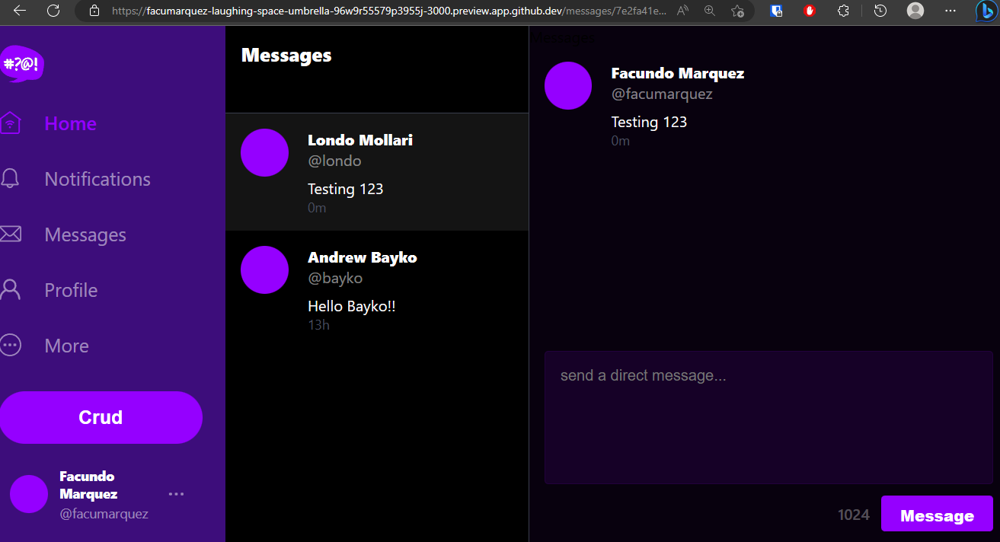
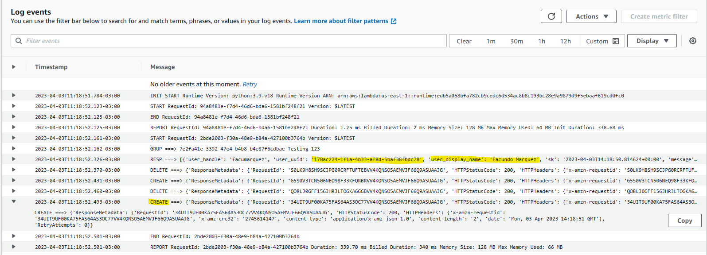

# Week 5 — DynamoDB and Serverless Caching

## Implement Schema Load Script

## Implement Seed Script

## Implement Scan Script

[File in my repo](https://github.com/facumarquez/aws-bootcamp-cruddur-2023/blob/main/backend-flask/bin/ddb/scan)

## Implement Pattern Scripts for Read and List Conversations

## Implement Update Cognito ID Script for Postgres Database

[File in my repo](https://github.com/facumarquez/aws-bootcamp-cruddur-2023/blob/main/backend-flask/db/sql/users/uuid_from_cognito_user_id.sql)

## Implement (Pattern A) Listing Messages in Message Group into Application

## Implement (Pattern B) Listing Messages Group into Application and 

## Implement (Pattern C) Creating a Message for an existing Message Group into Application

## Implement (Pattern D) Creating a Message for a new Message Group into Application

## Implement (Pattern E) Updating a Message Group using DynamoDB Streams

