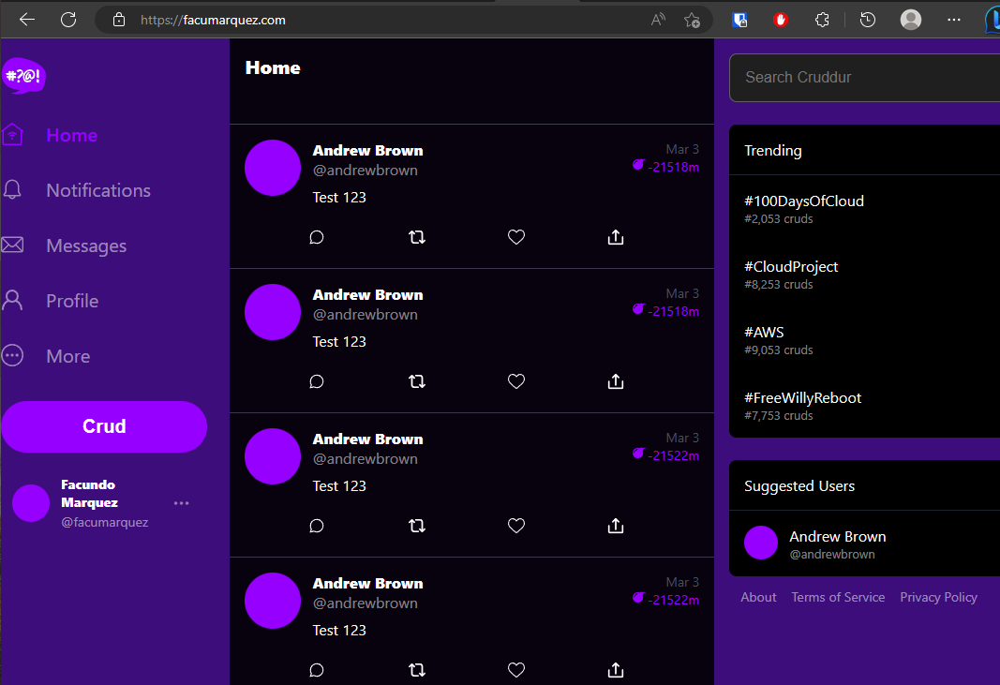

# Week 6 — Deploying Containers

## Provisioned ECS Cluster, created ECR repositories and pushed all the images

## Deployed backend and frontend app in Fargate

## Configured LB

## Managed my new domain with Route53

## Implemented Refresh Token for Amazon Cognito

## That is pretty much it

I think it is not neccesary to prove the other tasks are completed because this can be easily proved by reading the code.

Now the application is running in Fargate with a Load Balancer and using my own domain:

